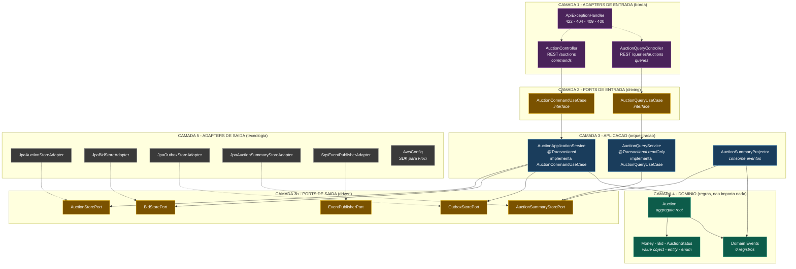

# 01 — Visão geral das camadas (hexagonal)

```mermaid
flowchart TB
    subgraph L1["CAMADA 1 - ADAPTERS DE ENTRADA (borda)"]
        direction LR
        A1["AuctionController<br/>REST /auctions<br/><i>commands</i>"]
        A2["AuctionQueryController<br/>REST /queries/auctions<br/><i>queries</i>"]
        A3["ApiExceptionHandler<br/>422 - 404 - 409 - 400"]
    end

    subgraph L2["CAMADA 2 - PORTS DE ENTRADA (driving)"]
        direction LR
        P1["AuctionCommandUseCase<br/><i>interface</i>"]
        P2["AuctionQueryUseCase<br/><i>interface</i>"]
    end

    subgraph L3["CAMADA 3 - APLICACAO (orquestracao)"]
        direction TB
        S1["AuctionApplicationService<br/><i>@Transactional</i><br/>implementa AuctionCommandUseCase"]
        S2["AuctionQueryService<br/><i>@Transactional readOnly</i><br/>implementa AuctionQueryUseCase"]
        S3["AuctionSummaryProjector<br/><i>consome eventos</i>"]
    end

    subgraph L4["CAMADA 3b - PORTS DE SAIDA (driven)"]
        direction LR
        PO1["AuctionStorePort"]
        PO2["BidStorePort"]
        PO3["OutboxStorePort"]
        PO4["AuctionSummaryStorePort"]
        PO5["EventPublisherPort"]
    end

    subgraph L5["CAMADA 4 - DOMINIO (regras, nao importa nada)"]
        direction TB
        D1["Auction<br/><i>aggregate root</i>"]
        D2["Money - Bid - AuctionStatus<br/><i>value object - entity - enum</i>"]
        D3["Domain Events<br/><i>6 registros</i>"]
    end

    subgraph L6["CAMADA 5 - ADAPTERS DE SAIDA (tecnologia)"]
        direction LR
        O1["JpaAuctionStoreAdapter"]
        O2["JpaBidStoreAdapter"]
        O3["JpaOutboxStoreAdapter"]
        O4["JpaAuctionSummaryStoreAdapter"]
        O5["SqsEventPublisherAdapter"]
        O6["AwsConfig<br/><i>SDK para Floci</i>"]
    end

    A1 --> P1
    A2 --> P2
    P1 --> S1
    P2 --> S2
    S1 --> PO1
    S1 --> PO2
    S1 --> PO3
    S2 --> PO4
    S3 --> PO4
    O1 -.-> PO1
    O2 -.-> PO2
    O3 -.-> PO3
    O4 -.-> PO4
    O5 -.-> PO5
    S1 --> D1
    S3 --> D3
    D1 --> D2
    D1 --> D3
    A3 -.-> A1
    A3 -.-> A2

    classDef entrada fill:#4a235a,stroke:#9b59b6,color:#fff
    classDef ports fill:#7a5200,stroke:#e0a800,color:#fff
    classDef app fill:#1a3d5c,stroke:#4a90c2,color:#fff
    classDef dominio fill:#0d5c4a,stroke:#3fae8f,color:#fff
    classDef saida fill:#3a3a3a,stroke:#8d8d8d,color:#fff
    class A1,A2,A3 entrada
    class P1,P2,PO1,PO2,PO3,PO4,PO5 ports
    class S1,S2,S3 app
    class D1,D2,D3 dominio
    class O1,O2,O3,O4,O5,O6 saida
```