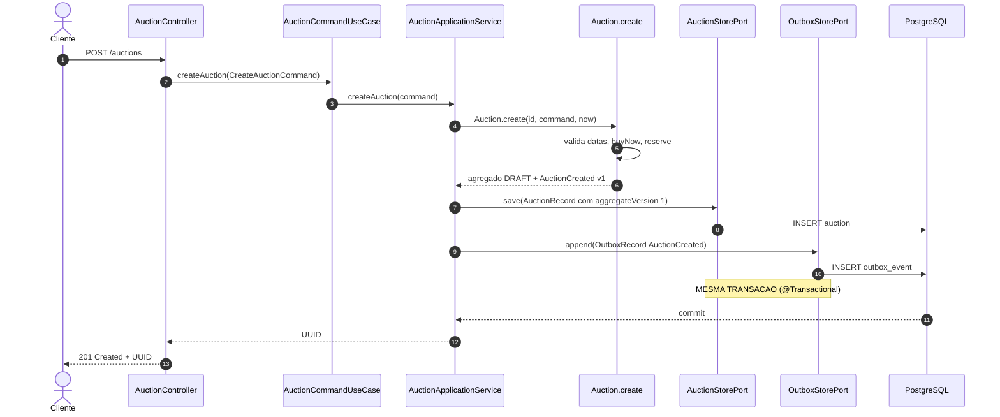
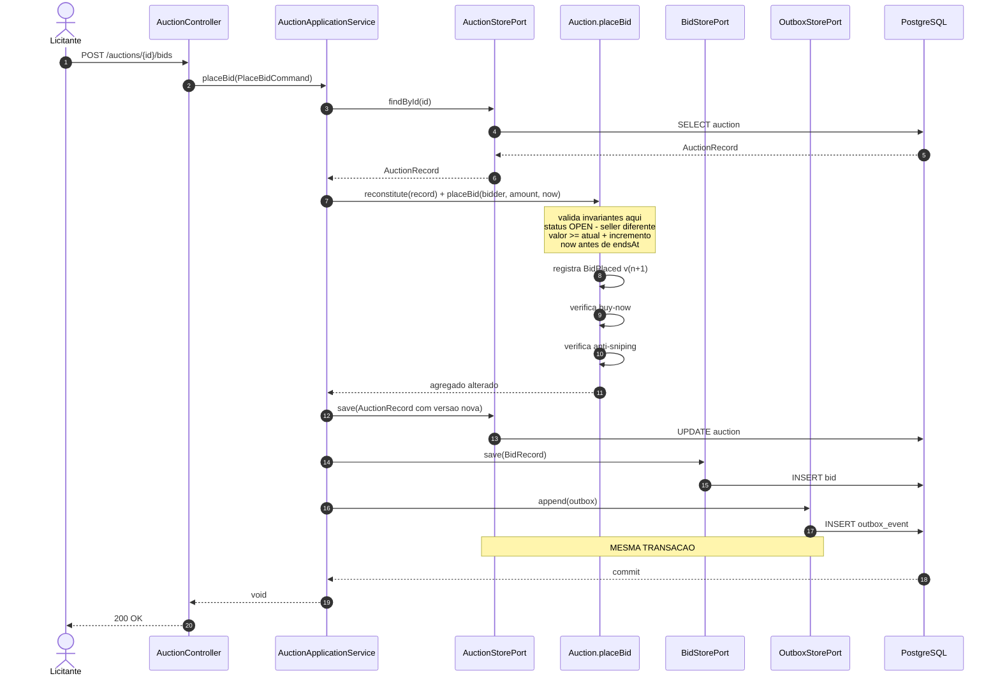
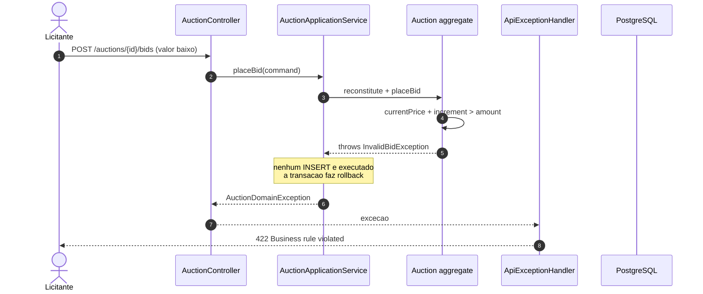

# 02 — Processo: comandos (escrita)

## 2.1 Criar leilão

```mermaid
sequenceDiagram
    autonumber
    actor C as Cliente
    participant CT as AuctionController
    participant UC as AuctionCommandUseCase
    participant S as AuctionApplicationService
    participant AG as Auction.create
    participant AP as AuctionStorePort
    participant OB as OutboxStorePort
    participant DB as PostgreSQL

    C->>CT: POST /auctions
    CT->>UC: createAuction(CreateAuctionCommand)
    UC->>S: createAuction(command)
    S->>AG: Auction.create(id, command, now)
    AG->>AG: valida datas, buyNow, reserve
    AG-->>S: agregado DRAFT + AuctionCreated v1
    S->>AP: save(AuctionRecord com aggregateVersion 1)
    AP->>DB: INSERT auction
    S->>OB: append(OutboxRecord AuctionCreated)
    OB->>DB: INSERT outbox_event
    Note over AP,OB: MESMA TRANSACAO (@Transactional)
    DB-->>S: commit
    S-->>CT: UUID
    CT-->>C: 201 Created + UUID
```

## 2.2 Dar lance (caminho feliz)

```mermaid
sequenceDiagram
    autonumber
    actor C as Licitante
    participant CT as AuctionController
    participant S as AuctionApplicationService
    participant AP as AuctionStorePort
    participant AG as Auction.placeBid
    participant BP as BidStorePort
    participant OB as OutboxStorePort
    participant DB as PostgreSQL

    C->>CT: POST /auctions/{id}/bids
    CT->>S: placeBid(PlaceBidCommand)
    S->>AP: findById(id)
    AP->>DB: SELECT auction
    DB-->>AP: AuctionRecord
    AP-->>S: AuctionRecord
    S->>AG: reconstitute(record) + placeBid(bidder, amount, now)
    Note over AG: valida invariantes aqui<br/>status OPEN - seller diferente<br/>valor >= atual + incremento<br/>now antes de endsAt
    AG->>AG: registra BidPlaced v(n+1)
    AG->>AG: verifica buy-now
    AG->>AG: verifica anti-sniping
    AG-->>S: agregado alterado
    S->>AP: save(AuctionRecord com versao nova)
    AP->>DB: UPDATE auction
    S->>BP: save(BidRecord)
    BP->>DB: INSERT bid
    S->>OB: append(outbox)
    OB->>DB: INSERT outbox_event
    Note over AP,OB: MESMA TRANSACAO
    DB-->>S: commit
    S-->>CT: void
    CT-->>C: 200 OK
```

## 2.3 Dar lance com regra violada

```mermaid
sequenceDiagram
    autonumber
    actor C as Licitante
    participant CT as AuctionController
    participant S as AuctionApplicationService
    participant AG as Auction aggregate
    participant H as ApiExceptionHandler
    participant DB as PostgreSQL

    C->>CT: POST /auctions/{id}/bids (valor baixo)
    CT->>S: placeBid(command)
    S->>AG: reconstitute + placeBid
    AG->>AG: currentPrice + increment > amount
    AG-->>S: throws InvalidBidException
    Note over S: nenhum INSERT e executado<br/>a transacao faz rollback
    S-->>CT: AuctionDomainException
    CT-->>H: excecao
    H-->>C: 422 Business rule violated
```