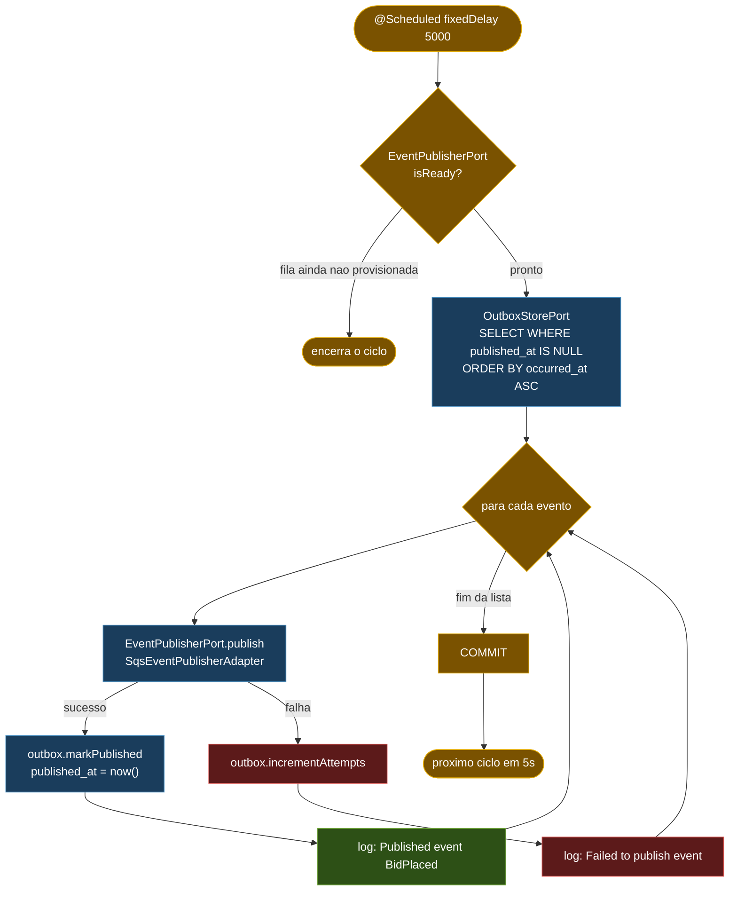
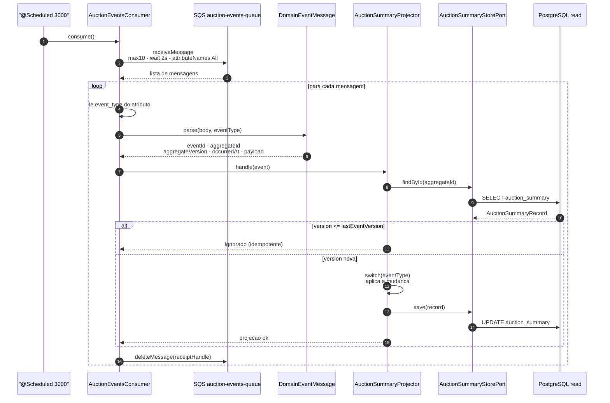

# 03 — Processo: pipeline de eventos

## 3.1 Outbox publisher (agendado, 5s)

```mermaid
flowchart TB
    START(["@Scheduled fixedDelay 5000"]) --> CHECK{"EventPublisherPort<br/>isReady?"}
    CHECK -->|"fila ainda nao provisionada"| END1(["encerra o ciclo"])
    CHECK -->|"pronto"| QUERY["OutboxStorePort<br/>SELECT WHERE published_at IS NULL<br/>ORDER BY occurred_at ASC"]
    QUERY --> LOOP{"para cada evento"}

    LOOP --> SEND["EventPublisherPort.publish<br/>SqsEventPublisherAdapter"]
    SEND -->|"sucesso"| MARK["outbox.markPublished<br/>published_at = now()"]
    MARK --> LOG1["log: Published event BidPlaced"]
    LOG1 --> LOOP

    SEND -->|"falha"| ATT["outbox.incrementAttempts"]
    ATT --> LOG2["log: Failed to publish event"]
    LOG2 --> LOOP

    LOOP -->|"fim da lista"| COMMIT["COMMIT"]
    COMMIT --> END2(["proximo ciclo em 5s"])

    classDef entrada fill:#7a5200,stroke:#e0a800,color:#fff
    classDef acao fill:#1a3d5c,stroke:#4a90c2,color:#fff
    classDef erro fill:#5c1a1a,stroke:#d9534f,color:#fff
    classDef ok fill:#2d5016,stroke:#7cb342,color:#fff
    class START,CHECK,LOOP,END1,END2,COMMIT entrada
    class QUERY,SEND,MARK acao
    class ATT,LOG2 erro
    class LOG1 ok
```

## 3.2 Consumer e projecao (agendado, 3s)

```mermaid
sequenceDiagram
    autonumber
    participant SCH as "@Scheduled 3000"
    participant CON as AuctionEventsConsumer
    participant SQS as SQS auction-events-queue
    participant ENC as DomainEventMessage
    participant PJ as AuctionSummaryProjector
    participant SP as AuctionSummaryStorePort
    participant DB as PostgreSQL read

    SCH->>CON: consume()
    CON->>SQS: receiveMessage<br/>max10 - wait 2s - attributeNames All
    SQS-->>CON: lista de mensagens
    loop para cada mensagem
        CON->>CON: le event_type do atributo
        CON->>ENC: parse(body, eventType)
        ENC-->>CON: eventId - aggregateId<br/>aggregateVersion - occurredAt - payload
        CON->>PJ: handle(event)
        PJ->>SP: findById(aggregateId)
        SP->>DB: SELECT auction_summary
        DB-->>SP: AuctionSummaryRecord
        alt version <= lastEventVersion
            PJ-->>CON: ignorado (idempotente)
        else version nova
            PJ->>PJ: switch(eventType)<br/>aplica a mudanca
            PJ->>SP: save(record)
            SP->>DB: UPDATE auction_summary
            PJ-->>CON: projecao ok
        end
        CON->>SQS: deleteMessage(receiptHandle)
    end
```

## 3.3 Visão geral do pipeline

```mermaid
flowchart LR
    WDB[("auction<br/>bid<br/>outbox_event")] -->|"1 - mesma transacao"| PUB["OutboxEventPublisher<br/>@Scheduled 5s"]
    PUB --> PORT["EventPublisherPort"]
    PORT -->|"2 - publish"| ADAPTER["SqsEventPublisherAdapter"]
    ADAPTER -->|"3 - SendMessage"| SQS[["SQS<br/>auction-events-queue"]]
    SQS -.->|"4 - poison message"| DLQ[["DLQ<br/>auction-events-dlq"]]
    SQS -->|"5 - receiveMessage"| CONS["AuctionEventsConsumer<br/>@Scheduled 3s"]
    CONS --> PROJ["AuctionSummaryProjector"]
    PROJ -->|"6 - idempotente por versao"| RDB[("auction_summary<br/>read model")]

    classDef dados fill:#2d5016,stroke:#7cb342,color:#fff
    classDef app fill:#1a3d5c,stroke:#4a90c2,color:#fff
    classDef porta fill:#7a5200,stroke:#e0a800,color:#fff
    classDef broker fill:#7f6000,stroke:#ffc000,color:#fff
    class WDB,RDB dados
    class PUB,CONS,PROJ,ADAPTER app
    class PORT porta
    class SQS,DLQ broker
```