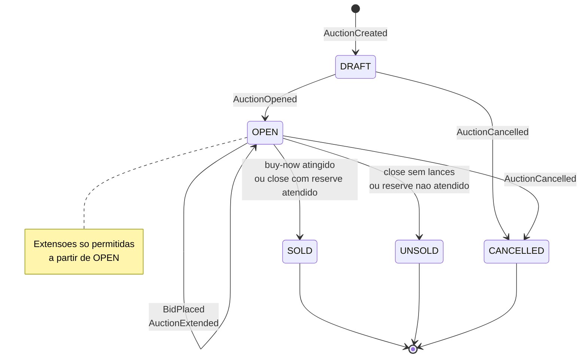

# 04 — Domínio: componente e estados

## 4.1 Aggregate Auction decomposto

```mermaid
flowchart TB
    subgraph AGG["AGGREGATE ROOT - Auction"]
        direction TB
        ID["Identity<br/><b>id</b> : UUID<br/><i>identidade da entidade</i>"]
        ATTR["Attributes<br/>title - description<br/>antiSnipingSeconds - createdAt"]
        LOT["Lot descriptor<br/><b>category</b> : AuctionCategory<br/><b>lotQuantity</b> : int<br/><b>lotUnit</b> : String<br/><i>generico para qualquer bem</i>"]
        WIN["Auction window<br/><b>startsAt</b> : Instant<br/><b>endsAt</b> : Instant<br/><i>endsAt e mutavel<br/>(anti-sniping)</i>"]
        ST["<b>status</b> : AuctionStatus<br/>DRAFT - OPEN - SOLD<br/>UNSOLD - CANCELLED"]
        PRICE["Price state<br/>startingPrice - minimumIncrement<br/>reservePrice - buyNowPrice<br/>currentPrice - highestBidderId<br/><b>version</b> : lock do JPA<br/><b>aggregateVersion</b> : ordem dos eventos"]
        BIDS["<b>bids</b> : lista de Bid<br/><i>colecao interna</i>"]

        ID --> ATTR
        ATTR --> LOT
        LOT --> WIN
        WIN --> ST
        ST --> PRICE
        PRICE --> BIDS
    end

    subgraph VO["VALUE OBJECTS - sem identidade, imutaveis"]
        direction LR
        VM["Money<br/>amount + currency<br/>add()<br/>isGreaterThan()<br/>isGreaterThanOrEqual()"]
        VC["AuctionCategory<br/>SINGLE_ITEM<br/>LOT_OF_GOODS<br/>LIVESTOCK<br/>VEHICLE<br/>AIRCRAFT<br/>REAL_ESTATE<br/><i>aceita valor livre</i>"]
    end

    subgraph BEH["COMPORTAMENTOS - unica API publica"]
        direction LR
        B1["create()<br/><i>static factory</i>"]
        B2["open()"]
        B3["placeBid()"]
        B4["close()"]
        B5["cancel()"]
        B6["reconstitute()<br/><i>nao emite eventos</i>"]
    end

    subgraph INV["INVARIANTES - garantidas aqui"]
        direction LR
        I1["bid >=<br/>startingPrice"]
        I2["bid >= currentPrice<br/>+ minimumIncrement"]
        I3["seller != bidder"]
        I4["bid somente se<br/>status = OPEN"]
        I5["bid antes<br/>de endsAt"]
        I6["reserve decide<br/>SOLD vs UNSOLD"]
        I7["buyNowPrice >= amount<br/>resulta em SOLD"]
        I8["antiSniping<br/>estende endsAt"]
        I9["buyNowPrice ><br/>startingPrice"]
    end

    BIDS --- VO
    BEH --> AGG
    INV -.->|"protege"| AGG

    classDef agg fill:#0d5c4a,stroke:#3fae8f,color:#fff
    classDef vo fill:#1a3d5c,stroke:#4a90c2,color:#fff
    classDef beh fill:#8b3a1f,stroke:#e07a4f,color:#fff
    classDef inv fill:#5c1a1a,stroke:#d9534f,color:#fff
    class ID,ATTR,LOT,WIN,ST,PRICE,BIDS agg
    class VM,VC vo
    class B1,B2,B3,B4,B5,B6 beh
    class I1,I2,I3,I4,I5,I6,I7,I8,I9 inv
```

## 4.2 Maquina de estados

```mermaid
stateDiagram-v2
    [*] --> DRAFT : AuctionCreated
    DRAFT --> OPEN : AuctionOpened
    OPEN --> OPEN : BidPlaced<br/>AuctionExtended
    OPEN --> SOLD : buy-now atingido<br/>ou close com reserve atendido
    OPEN --> UNSOLD : close sem lances<br/>ou reserve nao atendido
    DRAFT --> CANCELLED : AuctionCancelled
    OPEN --> CANCELLED : AuctionCancelled
    SOLD --> [*]
    UNSOLD --> [*]
    CANCELLED --> [*]

    note right of OPEN
        Extensoes so permitidas
        a partir de OPEN
    end note
```