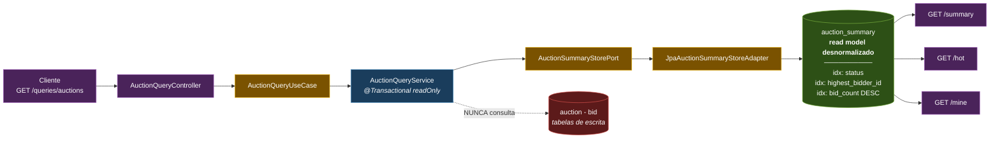
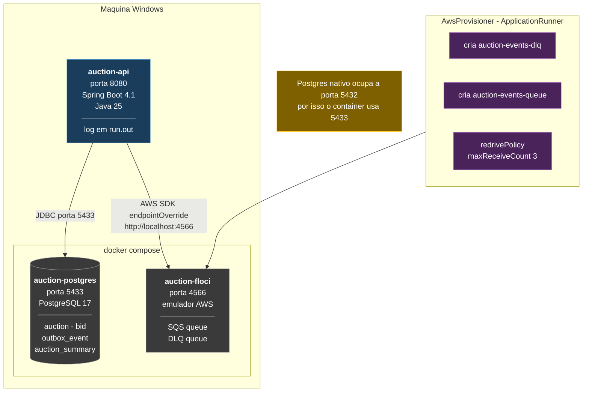
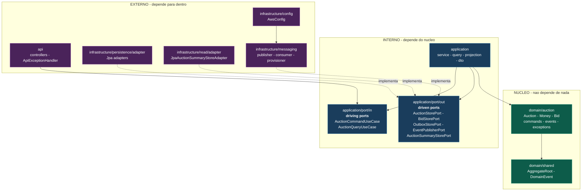

# 05 — Leitura e infraestrutura

## 5.1 Query side

```mermaid
flowchart LR
    C2["Cliente<br/>GET /queries/auctions"] --> QC["AuctionQueryController"]
    QC --> QU["AuctionQueryUseCase"]
    QU --> QS["AuctionQueryService<br/><i>@Transactional readOnly</i>"]
    QS --> SP["AuctionSummaryStorePort"]
    SP --> AD["JpaAuctionSummaryStoreAdapter"]
    AD --> RM[("auction_summary<br/><b>read model desnormalizado</b><br/>──────────<br/>idx: status<br/>idx: highest_bidder_id<br/>idx: bid_count DESC")]
    RM --> Q1["GET /summary"]
    RM --> Q2["GET /hot"]
    RM --> Q3["GET /mine"]

    QS -.->|"NUNCA consulta"| WR[("auction - bid<br/><i>tabelas de escrita</i>")]

    classDef entrada fill:#4a235a,stroke:#9b59b6,color:#fff
    classDef app fill:#1a3d5c,stroke:#4a90c2,color:#fff
    classDef porta fill:#7a5200,stroke:#e0a800,color:#fff
    classDef dados fill:#2d5016,stroke:#7cb342,color:#fff
    classDef proibido fill:#5c1a1a,stroke:#d9534f,color:#fff
    class C2,QC,Q1,Q2,Q3 entrada
    class QS app
    class QU,SP,AD porta
    class RM dados
    class WR proibido
```

## 5.2 Infraestrutura local

```mermaid
flowchart TB
    subgraph HOST["Maquina Windows"]
        direction TB
        subgraph DOCKER["docker compose"]
            direction LR
            PG[("<b>auction-postgres</b><br/>porta 5433<br/>PostgreSQL 17<br/>──────────<br/>auction - bid<br/>outbox_event<br/>auction_summary")]
            FLO["<b>auction-floci</b><br/>porta 4566<br/>emulador AWS<br/>──────────<br/>SQS queue<br/>DLQ queue"]
        end
        APP["<b>auction-api</b><br/>porta 8080<br/>Spring Boot 4.1<br/>Java 25<br/>──────────<br/>log em run.out"]
    end

    APP -->|"JDBC porta 5433"| PG
    APP -->|"AWS SDK endpointOverride<br/>http://localhost:4566"| FLO

    subgraph PROV["AwsProvisioner - ApplicationRunner"]
        direction LR
        PR1["cria auction-events-dlq"]
        PR2["cria auction-events-queue"]
        PR3["redrivePolicy<br/>maxReceiveCount 3"]
    end

    PROV --> FLO
    NOTE["Postgres nativo ocupa a porta 5432<br/>por isso o container usa 5433"]

    classDef infra fill:#3a3a3a,stroke:#8d8d8d,color:#fff
    classDef app fill:#1a3d5c,stroke:#4a90c2,color:#fff
    classDef prov fill:#4a235a,stroke:#9b59b6,color:#fff
    classDef nota fill:#7f6000,stroke:#ffc000,color:#fff
    class PG,FLO infra
    class APP app
    class PR1,PR2,PR3 prov
    class NOTE nota
```

## 5.3 Pacotes e regra de dependencia

```mermaid
flowchart TB
    subgraph CORE["NUCLEO - nao depende de nada"]
        D1["domain/auction<br/>Auction - Money - Bid<br/>commands - events - exceptions"]
        D2["domain/shared<br/>AggregateRoot - DomainEvent"]
    end

    subgraph INNER["INTERNO - depende do nucleo"]
        A1["application/port/in<br/><b>driving ports</b><br/>AuctionCommandUseCase<br/>AuctionQueryUseCase"]
        A2["application/port/out<br/><b>driven ports</b><br/>AuctionStorePort - BidStorePort<br/>OutboxStorePort - EventPublisherPort<br/>AuctionSummaryStorePort"]
        A3["application<br/>service - query - projection - dto"]
    end

    subgraph OUTER["EXTERNO - depende para dentro"]
        O1["api<br/>controllers - ApiExceptionHandler"]
        O2["infrastructure/persistence/adapter<br/>Jpa adapters"]
        O3["infrastructure/read/adapter<br/>JpaAuctionSummaryStoreAdapter"]
        O4["infrastructure/messaging<br/>publisher - consumer - provisioner"]
        O5["infrastructure/config<br/>AwsConfig"]
    end

    O1 --> A1
    A3 --> A1
    A3 --> A2
    A3 --> D1
    O2 -.->|"implementa"| A2
    O3 -.->|"implementa"| A2
    O4 -.->|"implementa"| A2
    O5 --> O4
    D1 --> D2

    classDef core fill:#0d5c4a,stroke:#3fae8f,color:#fff
    classDef inner fill:#1a3d5c,stroke:#4a90c2,color:#fff
    classDef outer fill:#4a235a,stroke:#9b59b6,color:#fff
    class D1,D2 core
    class A1,A2,A3 inner
    class O1,O2,O3,O4,O5 outer
```